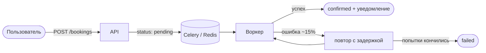
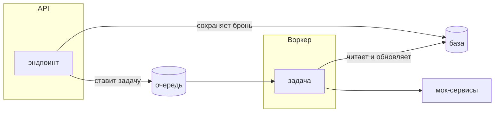
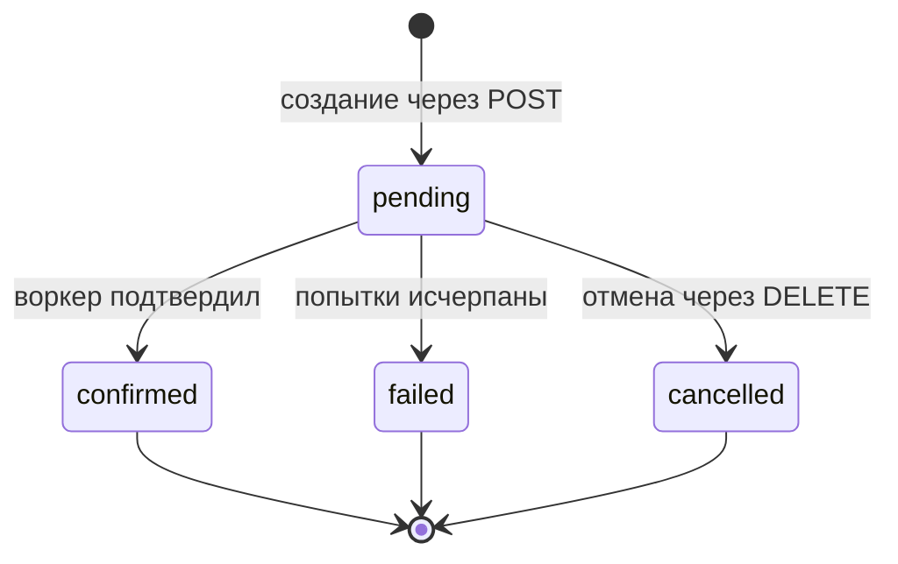
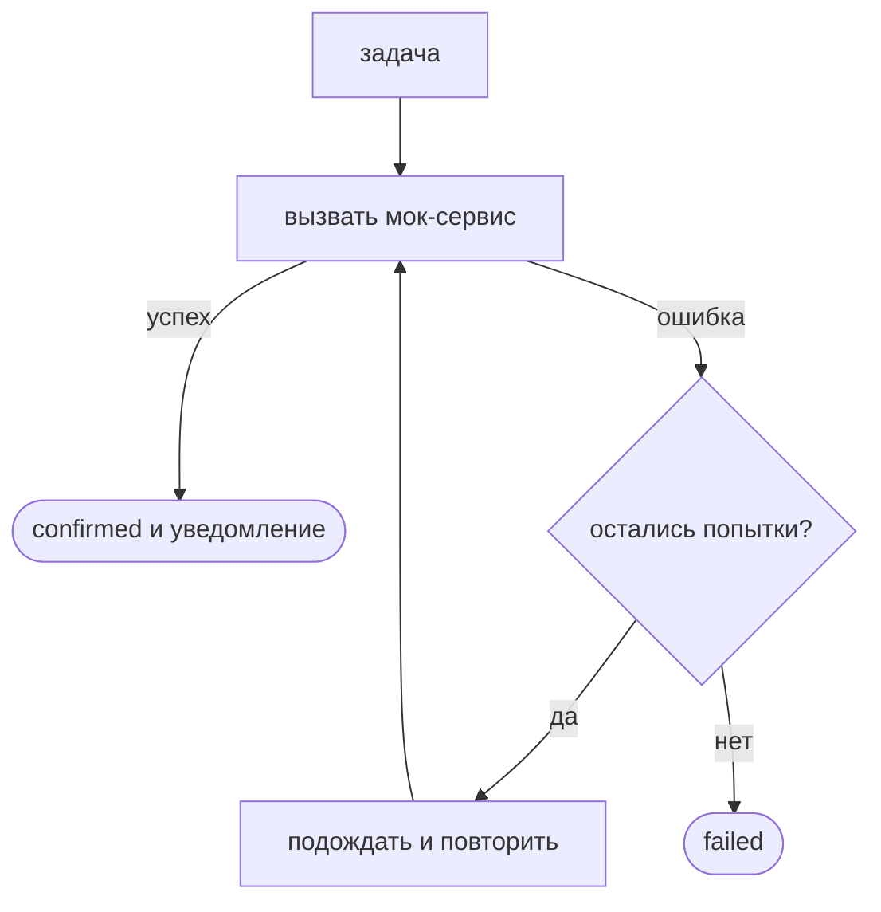
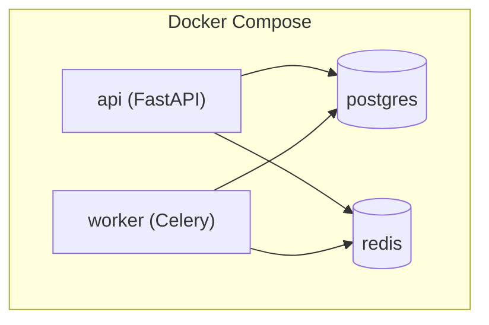

# Booking Service

Backend-сервис для записи на встречи.

Пользователь создаёт бронь через REST API. API сохраняет бронь в статусе `pending` и отправляет задачу в Celery. Воркер обрабатывает задачу в фоне. Он подтверждает бронь либо повторяет задачу с растущей задержкой, если мок-сервис выбросил ошибку.



## Оглавление

- [Стек](#стек)
- [Быстрый запуск](#быстрый-запуск)
- [Локальный запуск без Docker](#локальный-запуск-без-docker)
- [Переменные окружения](#переменные-окружения)
- [Makefile](#makefile)
- [API](#api)
- [Запуск тестов](#запуск-тестов)
- [Архитектура и технические решения](#архитектура-и-технические-решения)
  - [Структура проекта](#структура-проекта)
  - [Выбор фреймворка](#выбор-фреймворка)
  - [Статусы брони](#статусы-брони)
  - [Фоновая задача](#фоновая-задача)
  - [Идемпотентность](#идемпотентность)
  - [Повторные попытки](#повторные-попытки)
  - [Хранилище: PostgreSQL и SQLite в тестах](#хранилище-postgresql-и-sqlite-в-тестах)
  - [Ограничение частоты запросов](#ограничение-частоты-запросов)
  - [Логи](#логи)
  - [Отмена через cancelled](#отмена-через-cancelled)
  - [Docker Compose: детали](#docker-compose-детали)
- [Известные ограничения](#известные-ограничения)

## Стек

- FastAPI
- SQLAlchemy
- Alembic
- PostgreSQL
- Redis
- Celery
- pytest
- ruff
- Docker Compose

## Быстрый запуск

```bash
docker compose up --build
```

Если используется старая версия Docker Compose:

```bash
docker-compose up --build
```

Поднимаются четыре сервиса `api` (FastAPI), `worker` (Celery), `postgres` и `redis`. Миграции применяются автоматически при старте `api` (см. [Docker Compose: детали](#docker-compose-детали)).

После запуска API доступен на `http://127.0.0.1:8000`, Swagger UI на `http://127.0.0.1:8000/docs`.

Проверка здоровья:

```bash
curl http://127.0.0.1:8000/health
# {"status":"ok"}
```

## Локальный запуск без Docker

```bash
pip install -r requirements.txt
uvicorn app.main:app --reload
celery -A app.worker.celery_app.celery_app worker --loglevel=info
```

Для полноценной работы без Docker нужно отдельно поднять PostgreSQL и Redis и задать переменные из `.env.example`.

## Переменные окружения

Шаблон лежит в `.env.example`. Основные переменные:

- `APP_NAME`, `APP_ENV`
- `DATABASE_URL`
- `REDIS_URL`, `CELERY_BROKER_URL`, `CELERY_RESULT_BACKEND`
- `CELERY_TASK_MAX_RETRIES`, `CELERY_RETRY_BACKOFF_SECONDS`
- `BOOKINGS_RATE_LIMIT_PER_MINUTE`

## Makefile

```bash
make install       # установить зависимости
make dev           # запустить FastAPI локально
make worker        # запустить воркер Celery локально
make migrate       # применить миграции
make test          # запустить тесты
make lint          # запустить ruff
make docker-up     # поднять Docker Compose стек
make docker-down   # остановить Docker Compose стек
make docker-config # проверить docker-compose.yml
make docker-logs   # смотреть логи Docker Compose
```

## API

Интерактивная документация (Swagger UI) доступна на запущенном сервисе по адресу `http://127.0.0.1:8000/docs`. Там видны схемы запросов и ответов, а также коды ошибок (`400`, `404`, `422`, `429`).

```text
GET    /health
POST   /bookings
GET    /bookings/{id}
GET    /bookings?status=pending&limit=20&offset=0
DELETE /bookings/{id}
```

### Создать бронь

```bash
curl -X POST http://127.0.0.1:8000/bookings \
  -H "Content-Type: application/json" \
  -d '{
    "name": "Alex",
    "datetime": "2026-07-01T10:30:00+00:00",
    "service_type": "consultation"
  }'
```

Бронь создаётся в статусе `pending`, после чего API отправляет задачу в Celery. На `POST /bookings` стоит ограничение частоты запросов. При превышении лимита API вернёт `429 Too Many Requests` и заголовок `Retry-After`.

### Получить бронь

```bash
curl http://127.0.0.1:8000/bookings/1
```

### Список броней

```bash
curl "http://127.0.0.1:8000/bookings?status=pending&limit=20&offset=0"
```

Параметры:

- `status` необязательный фильтр по статусу (`pending`, `confirmed`, `failed`, `cancelled`);
- `limit` задаёт, сколько записей вернуть;
- `offset` задаёт, сколько записей пропустить.

### Отменить бронь

```bash
curl -X DELETE http://127.0.0.1:8000/bookings/1
```

Отменить можно только бронь в статусе `pending`. Вместо удаления строки бронь переводится в `cancelled`.

## Запуск тестов

```bash
pytest
```

Тесты запускаются без Docker. Для них используется SQLite, чтобы не требовать запущенный PostgreSQL.

## Архитектура и технические решения

Каждый раздел ниже отвечает и на вопрос почему так выбрано, и на вопрос как это работает.

### Структура проекта

```text
app/
  api/        # HTTP-эндпоинты (FastAPI router)
  core/       # конфиг, логирование, ограничение частоты запросов
  db/         # движок SQLAlchemy, сессии, Base
  models/     # ORM-модель Booking и enum статусов
  schemas/    # Pydantic-схемы запросов и ответов
  services/   # мок внешнего сервиса и мок-уведомления
  worker/     # Celery app и задачи
  main.py     # сборка FastAPI-приложения
alembic/      # миграции
tests/        # pytest
```

У каждой папки своя зона ответственности, и слои не лезут друг в друга. API принимает запрос, сохраняет бронь и кладёт задачу в очередь, но не знает, как устроен воркер. Воркер забирает задачу из очереди, работает с базой и мок-сервисами, но ничего не знает про FastAPI. Прямой связи между ними нет, общаются они только через очередь.



Задачу API ставит через одну тонкую функцию `enqueue_booking_processing`. В тестах её легко заменить заглушкой и проверять API без запущенных Celery и Redis.

### Выбор фреймворка

**FastAPI.** Выбрал по опыту, писал на нём не раз и знаю, чего ожидать. Для этой задачи он удобен сразу по нескольким причинам:

1. Pydantic сам проверяет тело `POST /bookings` и возвращает `422`, если что-то не так. Валидацию руками писать не нужно.
2. Swagger и схема OpenAPI генерируются прямо из типов эндпоинтов, поэтому документация не отстаёт от кода.
3. Async тут не нужен. Всю тяжёлую работу делает воркер, а синхронные ручки читать проще, поэтому оставил обычные `def`.

**Celery и Redis.** Celery уже использовал, и для фоновых задач он даёт всё из коробки. Повторы и задержка (`countdown`) уже встроены, свой планировщик писать не нужно. Redis здесь и очередь, и хранилище результатов.

В ТЗ как альтернативу Celery предлагали TaskIQ вместе с асинхронным FastAPI. Но API у меня синхронный, а повторы нужны надёжные, поэтому проще было взять знакомый Celery, чем тащить менее привычный стек ради ненужной тут асинхронности.

### Статусы брони

- `pending` означает новую бронь, которая ждёт фоновой обработки.
- `confirmed` ставится, когда воркер подтвердил бронь.
- `failed` ставится, когда обработка не удалась после всех повторных попыток.
- `cancelled` ставится при отмене через API.



Из `pending` бронь уходит ровно в один из финальных статусов, а `confirmed`, `failed` и `cancelled` уже не меняются.

### Фоновая задача

Код задачи разбит на три функции, чтобы основная логика не смешивалась с повторами.

- `process_booking_logic` делает саму работу. Находит бронь, обрабатывает только `pending`, вызывает мок-сервис (`app/services/external_booking.py`) и при успехе ставит `confirmed` и шлёт мок-уведомление (`app/services/notifications.py`). Про Celery не знает, поэтому тестируется без брокера.
- `process_booking` это задача Celery (`bind=True`). Ловит ошибку мок-сервиса и решает, повторить попытку или, когда попытки кончились, поставить `failed`. Тут живёт `self.retry`.
- `mark_booking_failed` переводит бронь в `failed` после исчерпания попыток.



Важная деталь. API сначала сохраняет бронь и только потом ставит задачу, поэтому воркер всегда видит её в базе. Клиент получает `201` сразу, не дожидаясь обработки.

### Идемпотентность

Задача может прийти повторно, так устроены очереди. Поэтому воркер обрабатывает только брони в статусе `pending`. Если задача пришла повторно для `confirmed`, `failed` или `cancelled`, воркер ничего не меняет, не вызывает мок-сервис, не отправляет уведомление второй раз и просто возвращает текущий статус. Этого достаточно, чтобы повторный запуск с тем же `booking_id` не ломал состояние.

Чтобы проверка статуса и обновление не разъезжались при конкуренции, бронь читается с блокировкой строки (`SELECT ... FOR UPDATE`). Это закрывает две гонки:

- при переходе `cancelled` → `confirmed` параллельная отмена не будет перетёрта подтверждением;
- повторная отправка уведомления при двойной доставке задачи.

На SQLite (тесты) блокировка строки ничего не делает, на PostgreSQL работает полноценно.

Дополнительно включён `task_acks_late`. Тогда задача подтверждается очереди только после завершения, и если воркер упадёт в середине обработки, она вернётся в очередь, а не оставит бронь навсегда в `pending`.

### Повторные попытки

При ошибке мок-сервиса задача не сразу уходит в `failed`. Сначала воркер повторяет её с растущей задержкой:

```text
2s → 4s → 8s
```

Пока попытки не кончились, бронь остаётся в `pending`. Если все попытки закончились ошибкой, воркер переводит её в `failed`. Число попыток и базовая задержка настраиваются через `CELERY_TASK_MAX_RETRIES` и `CELERY_RETRY_BACKOFF_SECONDS`.

### Хранилище: PostgreSQL и SQLite в тестах

PostgreSQL это основное хранилище в Docker и dev, как требует задание. Схема создаётся и обновляется миграциями Alembic. Прямого SQL нет, вся работа идёт через ORM-модель.

В тестах используется SQLite в памяти, чтобы `pytest` запускался из корня без поднятых PostgreSQL и Redis. Модель и запросы совместимы с обоими движками, а разница в поведении (например, `FOR UPDATE`) описана там, где она важна.

### Ограничение частоты запросов

На `POST /bookings` стоит простой счётчик в памяти процесса (значение задаётся переменной `BOOKINGS_RATE_LIMIT_PER_MINUTE`, по умолчанию 60). При превышении API возвращает `429 Too Many Requests` и заголовок `Retry-After`. Для тестового задания такого варианта достаточно. Подробнее в разделе [Известные ограничения](#известные-ограничения).

### Логи

Логи пишутся в JSON, так их проще фильтровать по полю `booking_id`, статусу или имени логгера. Пример события воркера:

```json
{"level":"info","logger":"app.worker.tasks","message":"Booking confirmed","booking_id":1,"status":"confirmed"}
```

### Отмена через cancelled

`DELETE /bookings/{id}` не удаляет строку, а переводит бронь в `cancelled`. Так сохраняется история, а воркер безопасно пропускает отменённые брони (см. [Идемпотентность](#идемпотентность)).

### Детали Docker Compose

`docker compose up` поднимает четыре сервиса `api`, `worker`, `postgres` и `redis`.



При старте `api` сначала применяет миграции, потом запускает приложение:

```bash
alembic upgrade head && uvicorn app.main:app
```

В compose настроены healthchecks. `api` ждёт готовности PostgreSQL и Redis, а `worker` стартует после готовности `api`, то есть после миграций.

В качестве `env_file` сервисы используют `.env.example` напрямую, а критичные переменные (`DATABASE_URL`, Redis и Celery URL) переопределяются в секции `environment`. Так стек поднимается одной командой, без ручного создания `.env`.

## Известные ограничения

Что упростил намеренно, под объём тестового задания.

- **Задача ставится после сохранения брони.** Сначала сохраняем бронь, потом ставим задачу, чтобы воркер точно нашёл её в базе. Минус в том, что если в этот момент очередь недоступна, бронь останется в `pending`.
- **Счётчик запросов хранится в памяти.** Лимит на `POST /bookings` живёт в памяти процесса и обнуляется при рестарте. При нескольких копиях API каждая считает свой лимит. Для прода его стоит вынести в Redis.
